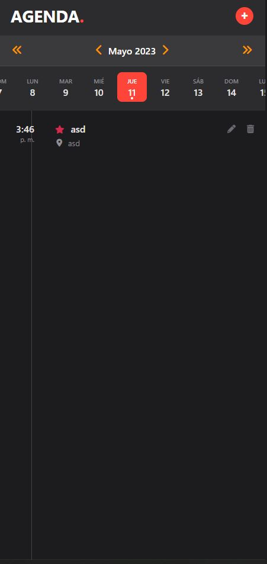

# 📅 AgendaHtml5

Una agenda simple desarrollada con **HTML5**, **CSS3** y **JavaScript**.  
Permite gestionar tareas o eventos de manera visual, rápida y sin necesidad de backend.

## ✨ Características

- Interfaz intuitiva y ligera  
- Diseño responsivo  
- 100% en el navegador (sin base de datos)  
- Añadir, editar y eliminar tareas o eventos

## 🖼️ Capturas de pantalla

| Vista principal | Agregando evento | Ejemplo de lista |
|-----------------|------------------|------------------|
|  |  |  |

## 🚀 Tecnologías utilizadas

- HTML5  
- CSS3  
- JavaScript puro

## 🔧 Cómo usar

1. Clona este repositorio:
   ```bash
   git clone https://github.com/jeancode/AgendaHtml5.git
